# BIP — Simulated Investment Platform (MVP)

A simulated investment platform: signup → simulated KYC → virtual cash wallet →
browse a demo market → place orders → simulated execution → portfolio, ledger,
and history. **No real money is ever collected or moved, no real orders are
ever executed.** See `BIP_Cahier_des_charges_MVP_Consolide.pdf` for the full
spec this MVP implements.

## Stack

- **Backend**: Python 3.12, FastAPI, SQLAlchemy, PostgreSQL, Alembic. Auto API
  docs at `/docs`.
- **Frontend**: Vue 3 (Composition API), Vite, Pinia, PrimeVue.
- **Market data**: `yfinance` for ~18 well-known tickers, ingested into the
  platform's own `Quote` table. Falls back to seeded plausible prices if
  yfinance is unreachable — the app never depends on live internet access.
- **Deployment**: local-only via `docker-compose` is the primary, always-
  supported path. An optional free-tier cloud deployment guide also exists —
  see [`docs/DEPLOYMENT.md`](docs/DEPLOYMENT.md).

## Quickstart

Requires Docker. The host machine's own Node/npm are **not** used — the
frontend dev server also runs inside its own container, avoiding any local
Node version issues.

```bash
cp .env.example .env
docker compose up -d
```

This starts three containers:

| Service    | URL                          |
|------------|-------------------------------|
| Postgres   | `localhost:5435`              |
| Backend    | `http://localhost:8010` (docs at `/docs`) |
| Frontend   | `http://localhost:5173`       |

First boot needs the database schema and seed data:

```bash
docker compose exec api alembic upgrade head
docker compose exec api python -m app.seed_demo
```

`seed_demo` runs the base seed (4 demo users across every role, 18 demo
instruments) and additionally KYC-validates and funds the `investor@bip.demo`
account with a small starting portfolio (a few executed buy/sell orders), so
the primary demo path never depends on a live action during a pitch.

Open `http://localhost:5173` and log in with any of:

| Email                     | Password        | Role                 |
|----------------------------|-----------------|----------------------|
| `investor@bip.demo`        | `DemoPass123!`  | Investor (pre-funded, KYC-validated) |
| `admin@bip.demo`           | `DemoPass123!`  | Admin                |
| `backoffice@bip.demo`      | `DemoPass123!`  | Back-office operator |
| `superadmin@bip.demo`      | `DemoPass123!`  | Super-admin          |

## Demo walkthrough

**Investor path** (as `investor@bip.demo`, already funded/validated):
1. Dashboard → cash + portfolio value at a glance.
2. Market → browse instruments, open one (e.g. AAPL) → price history chart.
3. Place a buy or sell order → confirm dialog → executes instantly (this MVP
   simulates execution synchronously — no order book, no waiting).
4. Order detail page → shows the full chain: order → execution → linked
   ledger entries, with running balances.
5. Portfolio / Ledger pages → live-computed from positions + ledger, never a
   stale cached number.

**Fresh signup path** (register a new account):
1. Register → redirected straight into the KYC form.
2. Fill it in, submit → status becomes "submitted, awaiting review".
3. Log in as `backoffice@bip.demo` (or `admin`/`super_admin`) → **Back-office
   → KYC Queue** → Validate → the account activates and is credited
   automatically.
4. Log back in as the investor → account is now active and funded.

**Back-office path** (as `backoffice@bip.demo` / `admin@bip.demo` /
`superadmin@bip.demo`):
- **KYC Queue** — validate/reject pending submissions.
- **Users** — view all users; role changes are super-admin only.
- **Accounts** — suspend/reactivate an account (a suspended account can't
  place new orders — pre-trade checks reject them with an explicit reason).
- **Instruments** — toggle tradability, add new instruments, force a market
  price refresh.
- **Orders / Ledger / Audit Log** — full read-only oversight across every
  account.
- **Settings** — super-admin-only platform configuration (e.g. fee rate).

## Running the backend test suite

```bash
docker compose exec api pytest
```

`tests/financial_invariants/` is the most important directory — it covers
concurrency (no double-spend/double-sell), atomicity (a mid-execution failure
rolls back everything), and ledger/position reconciliation. These tests use a
separate `bip_test` database so they never touch the dev/demo data above.

## Project structure

```
backend/app/
  core/     config, security (JWT/bcrypt), auth deps, error types
  models/   SQLAlchemy models — one file per entity
  schemas/  Pydantic request/response models
  routers/  HTTP layer only, no business logic
  services/ orchestration layer
  engine/   the financial core: pretrade checks, reservation locking,
            OMS state machine, execution — pure, no HTTP/FastAPI imports
  workers/  yfinance ingestion (startup backfill + periodic refresh)
backend/tests/
  financial_invariants/  concurrency, atomicity, reconciliation
  api/, unit/             everything else

frontend/src/
  api/      one module per backend domain
  stores/   Pinia state
  router/   role-based route guards
  layouts/  AppShell (nav + role-aware menu)
  views/    auth/, onboarding/, market/, orders/, portfolio/, ledger/,
            backoffice/
```

## Known simplifications (by design, for a 2-week MVP)

- Order execution is synchronous (submit = execute in one request) — no
  order book, no partial fills. Still models a proper OMS state machine and
  full order→reservation→execution→ledger→position traceability.
- Single currency (USD), matching the yfinance-sourced tickers used for the
  demo market. Purely a display/config choice to change later.
- RBAC is 4 fixed roles enforced by route/endpoint guards — no fine-grained
  permission matrix.
- Password reset works end-to-end (`/auth/forgot-password` →
  `/auth/reset-password`, single-use tokens, 30-minute expiry) but there is no
  outbound email integration — the reset token is returned directly in the
  API/UI instead of emailed, the same "simulated, not real infra" approach
  used for KYC.

## Documentation

Beyond this README, [`docs/`](docs/) has the deliverables listed in the
cahier des charges (§33): [data model](docs/DATA_MODEL.md),
[user guide](docs/USER_GUIDE.md), [admin/back-office guide](docs/ADMIN_GUIDE.md),
and [test plan & report](docs/TEST_PLAN_AND_REPORT.md). Full API reference is
the live OpenAPI docs at `/docs` (see Quickstart) rather than a static copy,
so it never drifts from the actual code. For an optional free-tier cloud
deployment, see [`docs/DEPLOYMENT.md`](docs/DEPLOYMENT.md).

## Platform walkthrough (screenshots)

A visual, step-by-step tour of the complete platform — every screen an
investor or a back-office operator sees, in the order you'd actually
encounter them during a demo.

### 1. Sign up and sign in

**Login.** Returning users sign in here. Demo credentials for all four roles
are listed right on the page so a reviewer never has to dig through docs
mid-demo.

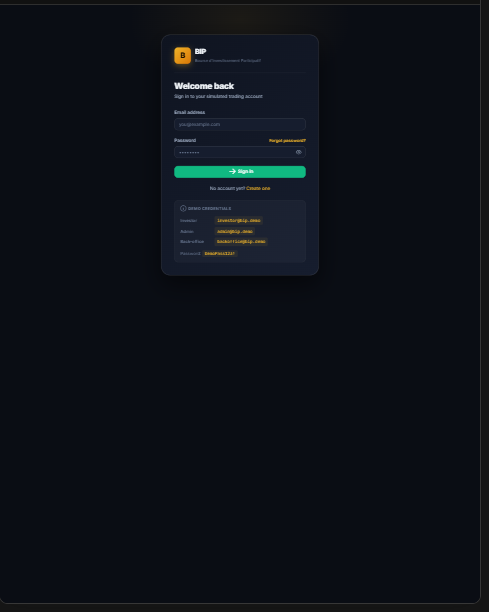

**Register.** New investors create an account with just a name, email, and
password — they're signed in immediately and dropped straight into KYC, no
email confirmation step (this is a simulation, not a real brokerage).

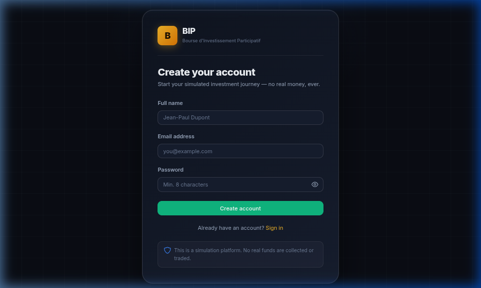

**Forgot password.** Since there's no outbound email integration in this
MVP, the reset flow is fully self-service: request a reset, get a token, set
a new password — all inside the app instead of an inbox.

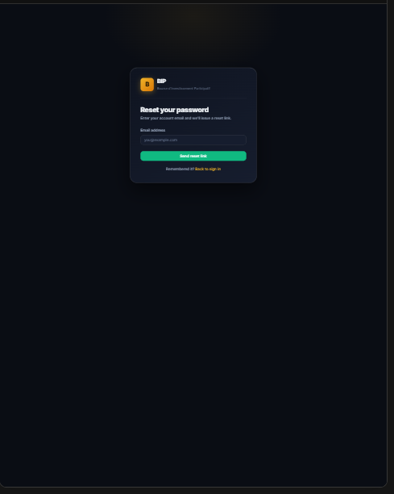

### 2. Onboarding: simulated KYC

**KYC form.** Every fresh signup lands here before they can trade. It's
explicitly labeled as a simulated identity check — legal name, date of
birth, country, and an ID document type/number, nothing more.

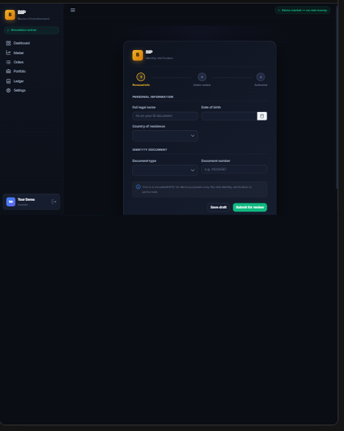

**Awaiting review.** After submitting, the account sits in "submitted"
status. The three-step tracker (Personal info → Under review → Activated)
tells the investor exactly where they stand while a back-office operator
reviews the file.

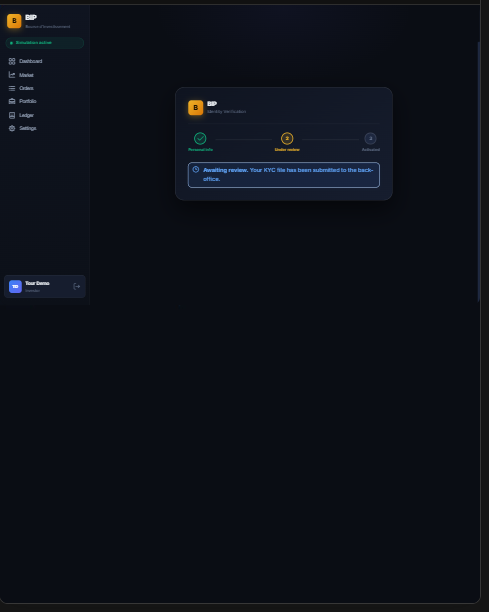

### 3. The investor experience

**Dashboard.** The investor's home base: cash available, total portfolio
value, open positions, unrealized P&L, and the most recent orders — the
whole account at a glance the moment you log in.

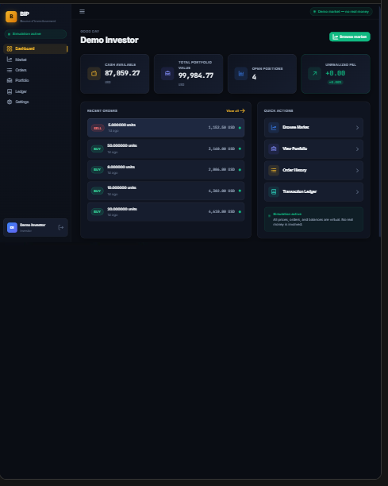

**Market.** Every tradable instrument in one sortable, filterable table —
symbol, company, sector, last price, and tradability status. This is the
platform's demo market (18 well-known tickers, real price data via
yfinance).

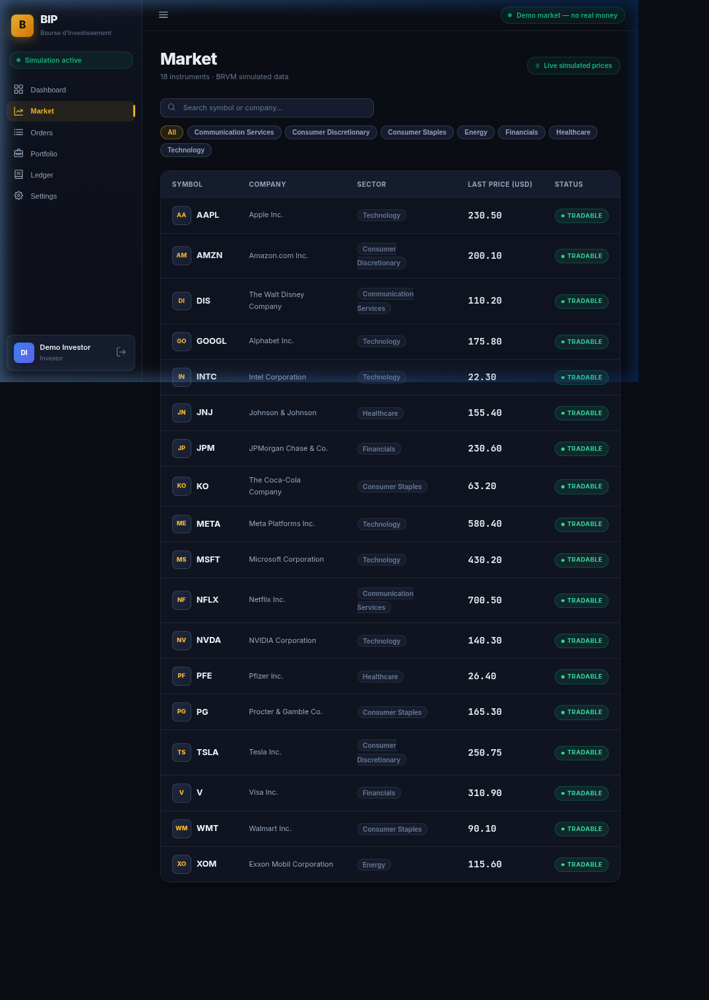

**Instrument detail.** Click any symbol to see its price history chart and
an order ticket right next to it — buy or sell, market or limit, with a
live-computed estimate (gross amount, commission, total) before you commit
to anything.

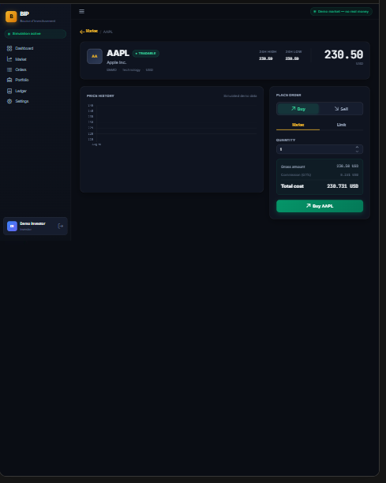

**Confirm order.** Nothing executes silently — every order shows a final
confirmation with the exact cost before it's sent. Behind the scenes, the
platform is already running pre-trade checks (account active, KYC
validated, enough available cash/shares).

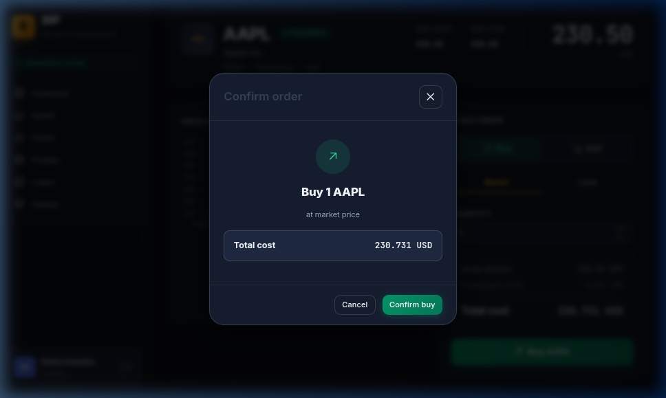

**Order detail.** Because this MVP executes synchronously, confirming an
order takes you straight to its full detail page: the order itself, its
execution (price, quantity, fee), and every ledger entry it produced — the
complete order → execution → ledger chain in one view.

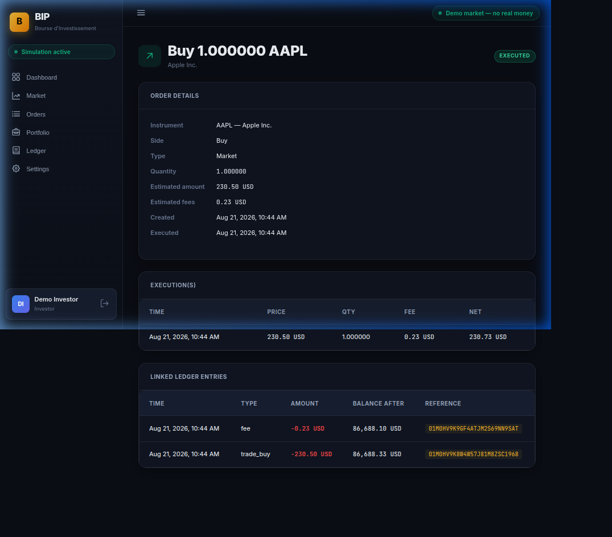

**Order history.** Every order ever placed on the account, with status
(executed, rejected, reserved, cancelled) at a glance. Open any row to jump
back into its detail page.

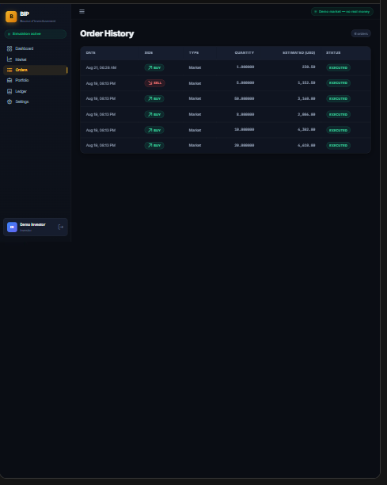

**Portfolio.** Open positions — quantity, average cost, last price, market
value — plus cash available vs. reserved and unrealized P&L. Always
computed live from positions and ledger, never a stale cached number.

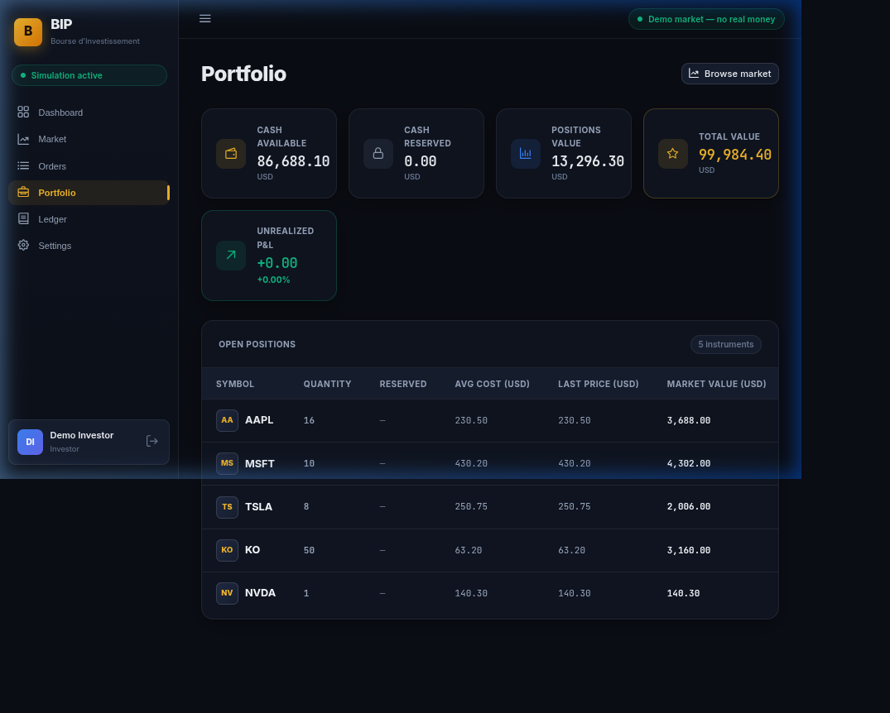

**Ledger.** The immutable, chronological record of every cash movement on
the account — initial credit, trades, fees — each with a running balance.

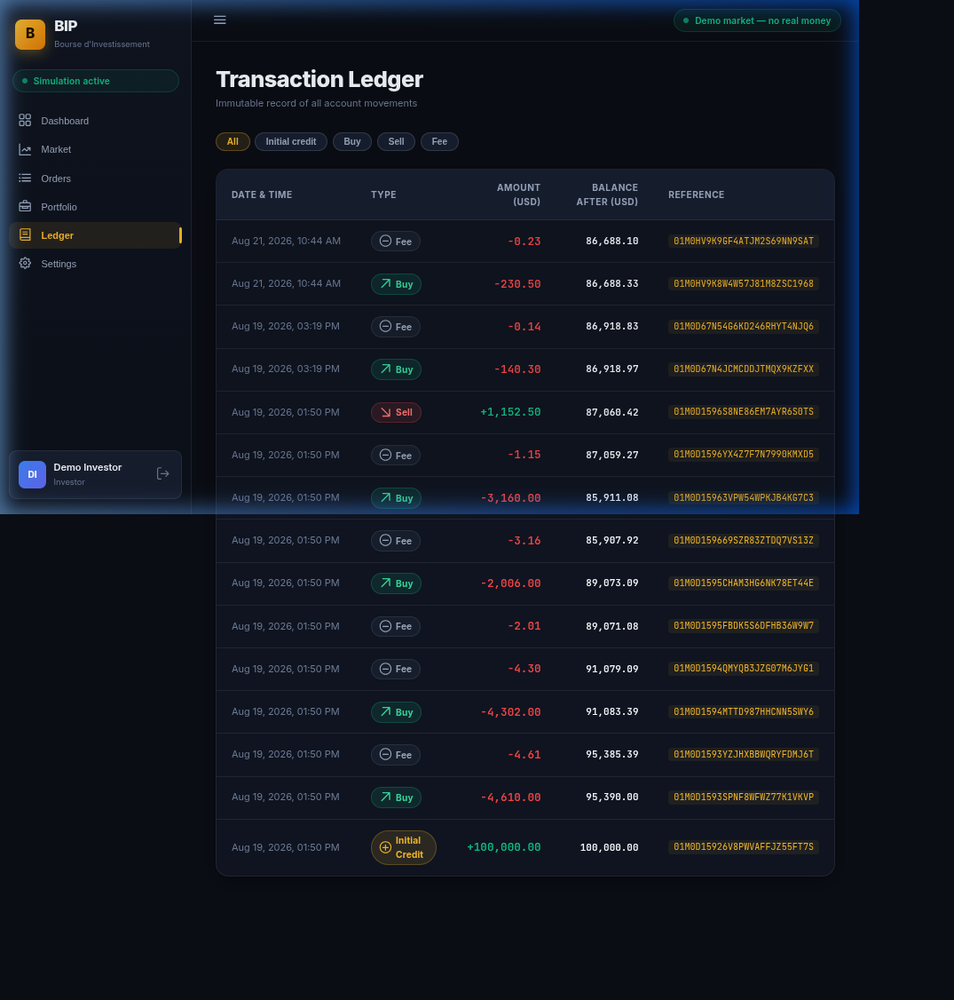

**Account settings.** Change your password here (current password
required). It's the same self-service pattern as the forgot-password flow —
no email round-trip needed.

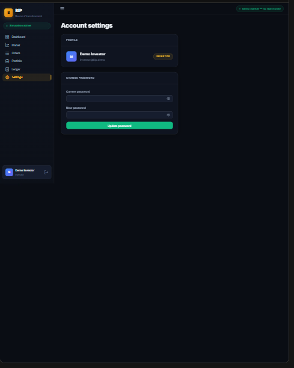

### 4. Back-office & administration

Everything below is visible only to staff roles (`backoffice_operator`,
`admin`, `super_admin`) — enforced server-side, not just hidden in the UI.

**Back-office dashboard.** A platform-wide operational snapshot: pending KYC
reviews, total users, total/executed/rejected orders — the first thing a
staff member sees, with quick links into every other back-office screen.

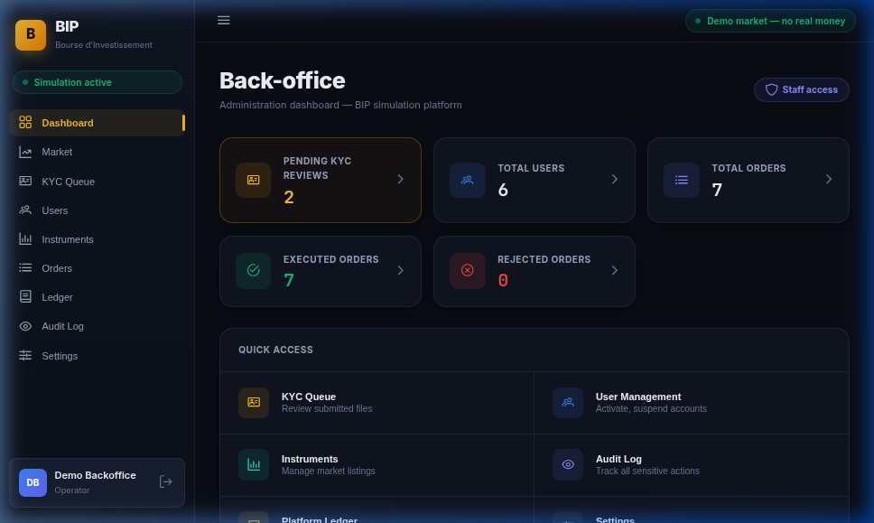

**KYC queue.** Every submitted KYC file awaiting review, with **Validate**
and **Reject** actions right in the row. Validating an account is atomic —
it activates the account and credits its starting simulated cash balance in
the same transaction, so there's never a window where it's active but
unfunded.

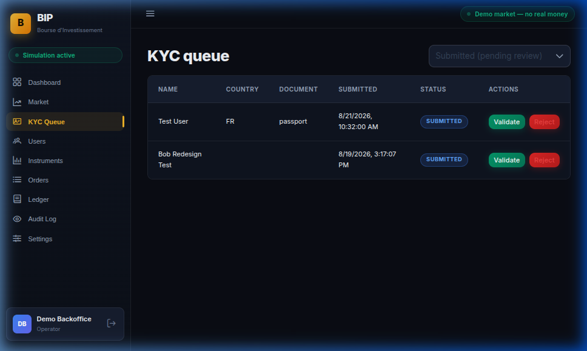

**Users & accounts.** Every user and their role (role changes are
super-admin only), plus every trading account with its cash balance,
reserved funds, and status — suspend an account here to immediately block it
from placing new orders.

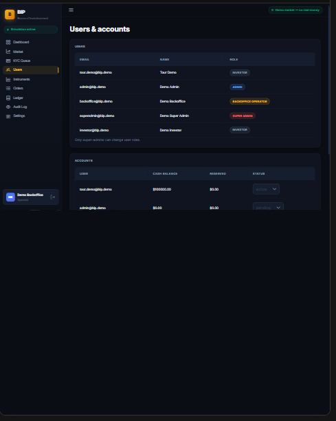

**Instruments.** Manage the tradable-instrument list: add a new instrument,
edit its details, toggle tradability, or force an on-demand price refresh
from the market data feed instead of waiting for the periodic background
job.

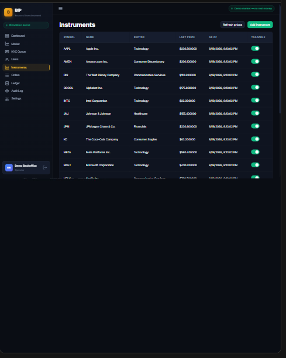

**Orders (oversight).** Read-only visibility into every order across
**every** account on the platform — not just your own — filterable by
status, account, and date. Useful for tracing any transaction end-to-end
during a review.

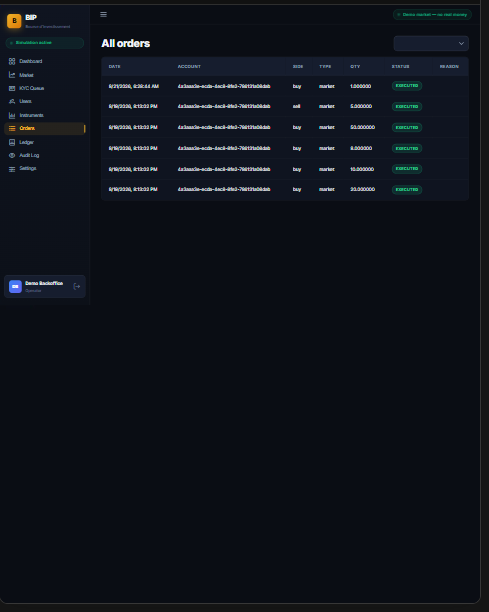

**Ledger (oversight).** The same immutable ledger investors see, but for
every account at once — the platform's full financial trail in one table.

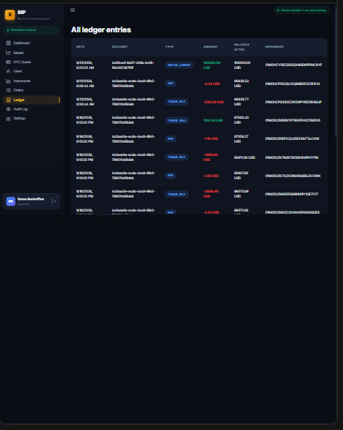

**Audit log.** Every sensitive action recorded platform-wide — order
execution, KYC review, account status changes, role changes, settings
edits — each with the actor, their role, the action, the affected entity,
and a timestamp. This is the traceability trail referenced in the cahier
des charges (§23/§24).

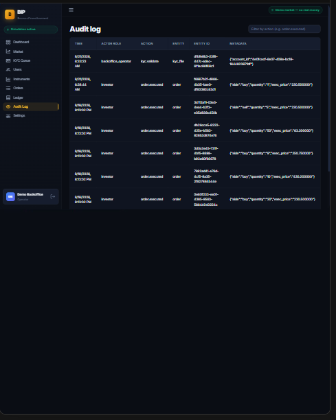

**Platform settings.** Super-admin only. Platform-wide simulation
parameters (like the trading fee rate) stored as key/value pairs. Changes
here only affect *future* orders — trades that already executed keep the
fee rate they were charged at.

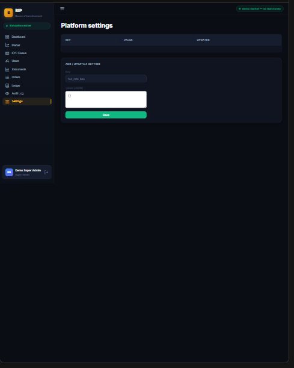
