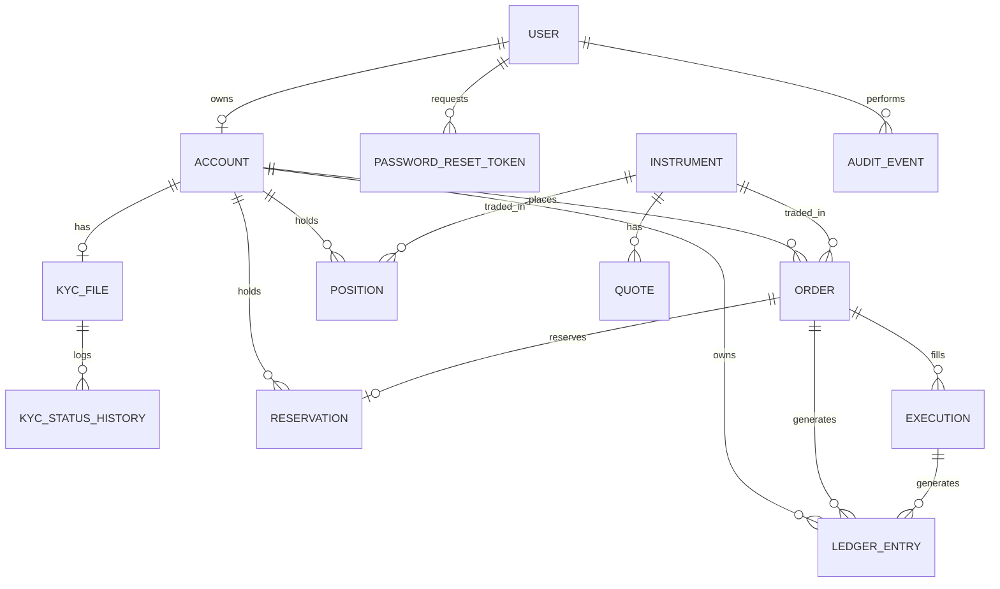

# Data Model

Maps to cahier des charges §27. Every table below is a real SQLAlchemy model
in `backend/app/models/` — this document doesn't introduce anything the code
doesn't already enforce; it's a reading guide to it, kept short on purpose so
it can't drift far from the code before someone notices.

## Entity-relationship diagram



## Entities

| Entity | Table | Key fields | Notes |
|---|---|---|---|
| **User** | `users` | email (unique), password_hash, role | Role is one of the 4 fixed RBAC roles ([enums.py](../backend/app/models/enums.py)) |
| **Account** | `accounts` | user_id (unique — 1:1), status, currency, cash_balance, cash_reserved | DB-level CHECK constraints: `cash_balance >= 0`, `cash_reserved >= 0`, `cash_reserved <= cash_balance` |
| **KycFile** | `kyc_files` | account_id (unique), status, full_legal_name, birth_date, country, id_document_type/number | One per account; `extra` (JSON) holds any additional demo fields |
| **KycStatusHistory** | `kyc_status_history` | kyc_file_id, from_status, to_status, changed_by, changed_at | Full audit trail of every KYC status transition (§10 "traçabilité des changements de statut") |
| **Instrument** | `instruments` | symbol (unique), name, market, sector, currency, tradable, last_price | The tradable-instrument referential (§11) |
| **Quote** | `quotes` | instrument_id, price, as_of, open/high/low/close, volume, source | Historical price ticks; unique on (instrument_id, as_of) |
| **Order** | `orders` | account_id, instrument_id, side, order_type, quantity, limit_price, status | Status machine enforced in [`engine/oms.py`](../backend/app/engine/oms.py) — never assigned directly anywhere else |
| **Reservation** | `reservations` | order_id (unique — 1:1), kind (cash/shares), amount or quantity, status | The hold that prevents double-spend/double-sell (§17) |
| **Execution** | `executions` | order_id, instrument_id, quantity, price, fees, gross/net amount | One row per fill; MVP does synchronous full fills only (no partials) |
| **LedgerEntry** | `ledger_entries` | account_id, entry_type, amount (signed), balance_after, order_id, execution_id | Append-only — no update/delete path exists anywhere in the codebase (§20) |
| **Position** | `positions` | account_id + instrument_id (unique pair), quantity, reserved_quantity, avg_cost | CHECK constraints mirror the account's: quantities can't go negative or over-reserve |
| **AuditEvent** | `audit_events` | actor_user_id, actor_role, action, entity_type, entity_id, metadata | Every sensitive action (order execution/rejection, KYC review, role change, account status change) (§23/§24) |
| **PlatformSetting** | `platform_settings` | key (PK), value (JSON), updated_by | Back-office-editable simulation parameters (e.g. fee rate) (§22) |
| **PasswordResetToken** | `password_reset_tokens` | user_id, token_hash (SHA-256, unique), expires_at, used_at | Only a hash of the token is ever stored; single-use, 30-minute expiry by default |

## What's deliberately not a separate table

- **Portfolio** is not stored — it's computed on read from `Account` + `Position` + `Instrument.last_price`
  ([`portfolio_service.py`](../backend/app/services/portfolio_service.py)), so it can never drift from the ledger.
- **Role/permission** is not a join table — RBAC is 4 fixed roles on `User.role`, checked at the route layer
  ([`core/deps.py`](../backend/app/core/deps.py)). A fine-grained permission matrix is out of MVP scope (see README's
  "Known simplifications").

## Traceability

Every financial operation is reconstructable end-to-end via foreign keys, per §27's requirement:

```
Order → Reservation → Execution → LedgerEntry → Position
```

`backend/tests/financial_invariants/test_ledger_reconciliation.py::test_full_chain_traceability_order_reservation_execution_ledger_position`
is a standing test that walks this exact chain.
